<div align="center">



<br>


<br>


</div>

---

# `01` // ABOUT ME


### 👨‍💻 Lucas Cortes

```yaml
name: Lucas Cortes
role: Student Developer
education: Ensino Médio Técnico em IoT
institution: SENAI

interests:
  - Artificial Intelligence
  - Internet of Things
  - Automation
  - Software Engineering
  - Local AI
  - Product Development

currently_building:
  - AI Agents
  - Automation Systems
  - Voice Assistants
  - AI-powered Applications

mission: "Build intelligent systems that solve real problems"
```

Sou estudante de **IoT e desenvolvimento de software**, explorando a interseção entre **Inteligência Artificial, automação, sistemas locais e desenvolvimento web**.

Tenho interesse especial em transformar conceitos de ficção científica em sistemas reais — especialmente **assistentes de IA, agentes, automações e ferramentas capazes de interagir com computadores e aplicações**.

Atualmente, meu foco está em aprender construindo: desenvolver projetos, experimentar arquiteturas diferentes e transformar ideias em sistemas funcionais.

<br clear="right"/>

---

# `02` // TECH STACK

<div align="center">

### 🧠 Artificial Intelligence


<br><br>

### 💻 Development


<br><br>

### ⚙️ Infrastructure & Tools


<br><br>

### 🔌 IoT & Hardware


</div>

---

# `03` // TOOLKIT

<div align="center">

|     Category    | Technologies                              |
| :-------------: | :---------------------------------------- |
|      🤖 AI      | LLMs · AI APIs · Agents · Local AI        |
|    🐍 Backend   | Python · Flask                            |
|   🌐 Frontend   | HTML · CSS · JavaScript · React           |
|      🔌 IoT     | Arduino · Raspberry Pi · Embedded Systems |
| 🛠️ Development | VS Code · Git · GitHub                    |
|  ☁️ Deployment  | Vercel · Cloud Services                   |
|   🖥️ Systems   | Windows · Linux · Terminal                |

</div>

---

# `04` // FEATURED PROJECTS

<div align="center">

<table>
<tr>

<td width="50%" valign="top">

### 🤖 THE FUTURE IA

**Local AI Ecosystem**

A long-term project focused on creating a local intelligent assistant inspired by **JARVIS**, capable of interacting with files, applications, terminal commands and development workflows.

`Python` `LLM` `AI Agents` `Automation`

</td>

<td width="50%" valign="top">

### ⚙️ AI AUTOMATION

**Intelligent Content Pipeline**

An automation ecosystem designed to use AI to generate, manage and distribute short-form content across social platforms.

`Python` `AI` `APIs` `Automation`

</td>

</tr>

<tr>

<td width="50%" valign="top">

### 🎙️ JARVIS / VOICE AI

**Experimental AI Assistant**

Experiments involving speech recognition, text-to-speech, LLM APIs and desktop automation to create a conversational computer interface.

`Python` `Voice AI` `LLM` `TTS`

</td>

<td width="50%" valign="top">

### 🌐 WEB & SOFTWARE

**Experiments & Applications**

Websites, automation tools, APIs and software experiments created while exploring modern development technologies.

`HTML` `CSS` `JavaScript` `Python`

</td>

</tr>
</table>

</div>

---

# `05` // CURRENT MISSION

```console
┌──[LUCAS@FUTURE]─[~]
└─$ mission --current

[✓] Learn software engineering
[✓] Build AI systems
[✓] Explore IoT
[✓] Study automation
[✓] Build real-world projects

[>] Improve software architecture
[>] Build stronger AI agents
[>] Develop intelligent automation
[>] Explore local LLMs
[>] Contribute to open source
[>] Turn ideas into deployable products

MISSION STATUS
████████████████░░░░ 80%

SYSTEM STATUS: ONLINE
```

### 🎯 ROADMAP

```text
2026
 │
 ├── AI & LLMs                 ████████████████░░░░
 ├── Software Engineering     ███████████████░░░░░
 ├── Automation                ████████████████░░░░
 ├── IoT                       █████████████░░░░░░░
 └── Open Source               ████████░░░░░░░░░░░░
 │
 ▼
2027
 │
 ├── Advanced AI Systems
 ├── Larger Projects
 ├── Open Source Contributions
 └── Production-ready Software
```

---

# `06` // GITHUB ANALYTICS

<div align="center">


<br><br>


<br><br>


</div>

---

# `07` // ACHIEVEMENTS

<div align="center">


</div>

---

# `08` // CONTRIBUTION MATRIX

<div align="center">

### 🐍 Contribution Snake


</div>

---

# `09` // SYSTEM ARCHITECTURE

<div align="center">

```text
                         ┌──────────────────────┐
                         │      USER INPUT      │
                         └──────────┬───────────┘
                                    │
                                    ▼
                    ┌──────────────────────────────┐
                    │       AI ORCHESTRATOR       │
                    └──────────────┬───────────────┘
                                   │
             ┌─────────────────────┼─────────────────────┐
             │                     │                     │
             ▼                     ▼                     ▼
      ┌─────────────┐       ┌─────────────┐       ┌─────────────┐
      │    LLM      │       │ AUTOMATION  │       │   TOOLS     │
      └──────┬──────┘       └──────┬──────┘       └──────┬──────┘
             │                     │                     │
             └─────────────────────┼─────────────────────┘
                                   │
                                   ▼
                    ┌──────────────────────────────┐
                    │       REAL WORLD ACTION      │
                    └──────────────────────────────┘
```

</div>

---

# `10` // SOCIAL NETWORK

<div align="center">

<a href="https://github.com/SEU_USERNAME">

</a>

<a href="https://www.linkedin.com/in/SEU_USERNAME">

</a>

<a href="https://www.instagram.com/SEU_USERNAME">

</a>

<a href="mailto:SEU_EMAIL">

</a>

</div>

---

# `11` // PROFILE STATUS

<div align="center">


<br><br>

```text
╔══════════════════════════════════════════════════════════╗
║                                                          ║
║                 SYSTEM ONLINE                            ║
║                                                          ║
║       LEARN  •  BUILD  •  AUTOMATE  •  INNOVATE         ║
║                                                          ║
║                 ████████████████████                     ║
║                                                          ║
║              CONNECTION: ESTABLISHED                    ║
║                                                          ║
╚══════════════════════════════════════════════════════════╝
```

### `// CONNECTION ESTABLISHED`

**Building the future, one commit at a time.**

<br>

`© 2026 Lucas Cortes`

</div>
